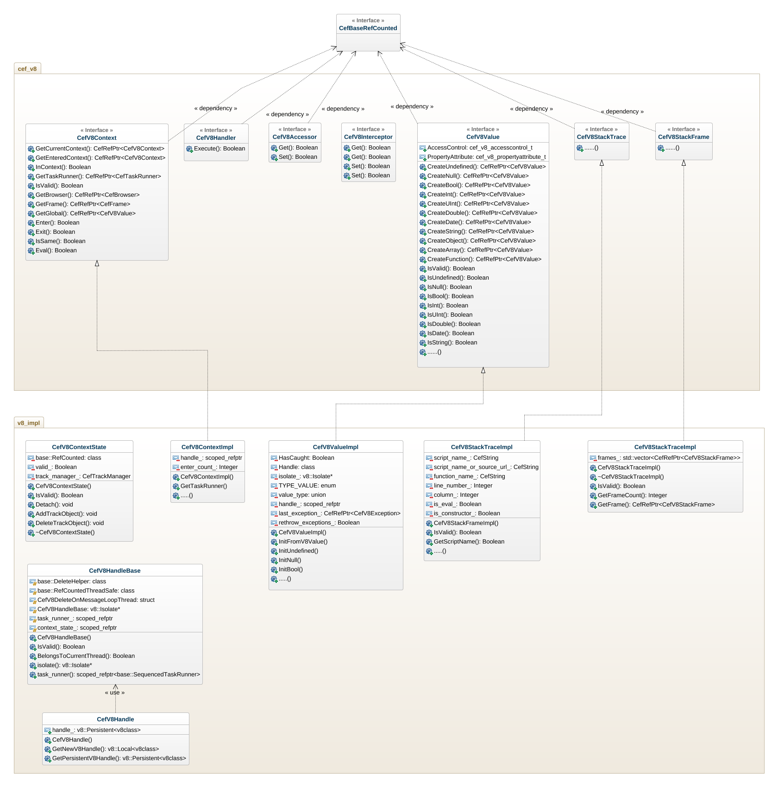

#### 缘起

由于要实现我司原有的JS扩展层（ModelJS）来支撑UI上的大量接口，而这些接口又没有定义，直接在浏览器里面声明全部报错，需要Native code来进行支持。所以，参照原来opera给出的方案，组里开始寻找替代品，最终找到了CEF来进行支持。

CEF类似于chromium content shell，但是它又大量封装了自己的一套方法，所以不是完全相同的。个人认为content shell是更纯净的CEF APP。由于近来任务需要，对CEF的V8实现部分进行了较深入的研究。直接先上图：

这张类图清晰地展示了一个general view。其实CEF做的东西并不复杂，大致的框架搞清楚后就可以剖析内部的具体内容了。CEF V8实现部分是对原有V8的东西进行了定制。接下来，要对一些用到的基本概念进行总结。

