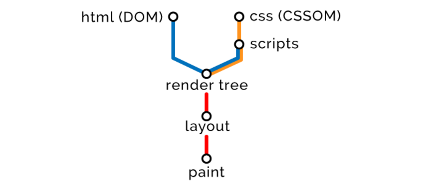
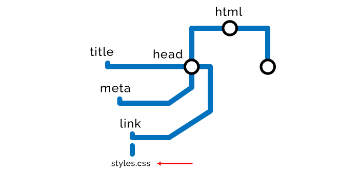
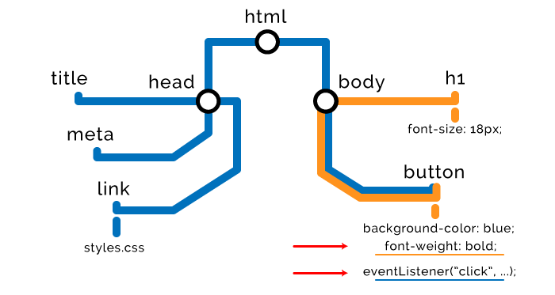
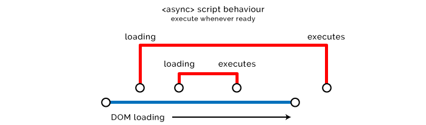
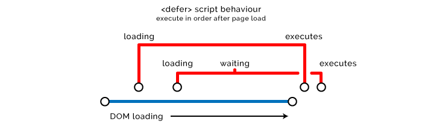
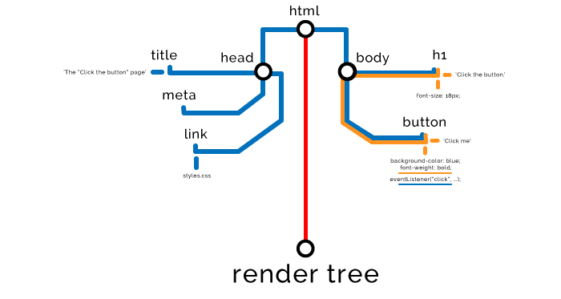

#### 背景
近来，由于评估的需要，要对UI进行些小范围优化。TV的UI界面又一定的局限性，这是它所在的环境引起的。
大部分家庭电视可能都不联网，静态资源加载往往是通过file system访问本地文件方式加载到浏览器的。而不是通过HTTP协议来获取。
所以此次优化的重心显然不在web request部分。所以多数优化工作是放在静态资源或者是JS加载上的

#### 基本策略
优化关乎于速度和满意度。从用户体验（UX）角度，希望前端网页能更快速地加载。从开发体验（DX）角度，希望前端是快速，简洁，规范的。
所以当我们打开一个网页时候，首先要知道浏览器都做了什么。当浏览器加载一个网页时候，它会构建一系列模型来对网页进行渲染，大致遵循如下步骤：

1. 使用 HTML 创建文档对象模型（DOM）
2. 使用 CSS 创建 CSS 对象模型（CSSOM）
3. 基于 DOM 和 CSSOM 执行脚本（Scripts）
4. 合并 DOM 和 CSSOM 形成渲染树（Render Tree）
5. 使用渲染树布局（Layout）所有元素
6. 渲染（Paint）所有元素



##### HTML加载策略
在这一步骤里，浏览器从上到下读取HTML标签，把他们分解为节点，从而创建DOM tree。图解如下：



优化策略：对于DOM这部分，总体思路是尽可能早的加载样式，尽可能晚的加载文本。由于脚本执行前，需要HTML和CSS解析完成。所以，样式尽可能
往顶部放，满足当底部脚本开始执行前，CSS有足够时间完成计算。

##### CSS加载策略
当浏览器发现任何节点相关的样式时，例如外部，内部，行内样式，则会立即停止渲染DOM，并利用这些节点来创建CSSOM。这便是CSS阻塞渲染的由来。
```
//外部样式
<link rel="stylesheet" href="styles.css">
// 内部样式
<style>
  h1 {
    font-size: 18px;
  }
</style>
// 行内样式
<button style="background-color: blue;">Click me</button>
```

CSSOM节点创建于DOM创建是类似的。都是类似属性的结构：


因此，为了防止CSS阻塞页面渲染，我们要尽早的加载CSS。所以这部分有如下的优化策略：
1. 延时加载CSS。有些样式比，如首屏以下的或不那么重要的部分，可以等待首屏加载完毕所有有价值的东西渲染后再加载，可以使用脚本等待页面加载后插入样式。
2. 加载所需要的样式。使用chromium dev tool和uncss等类似的工具，分析CSS的使用率，除去不必要或者未使用的样式。

##### Javascript加载策略
当浏览器不断的加载DOM或CSSOM节点，直到HTML底部发现外部或者行内脚本，就会开始JS的加载。需要注意的是，脚本可能需要访问或者操作之前的HTML或样式，
它必须要等待这些资源构建完成。因此浏览器需要停止解析DOM，完成构建CSSOM，执行JS，然后再继续。这就是JS被称作解析器阻塞的原因。



这部分的优化策略相对成熟。大致有如下几个要点：
1. 异步加载脚本。脚本使用asyn属性，可以通知浏览器不用阻塞其余页面的加载，加载脚本处于一个较低的优先级。一旦下载完成即可执行。



异步加载的方式只适用于不影响DOM或者CSSOM的脚本，比如一些统计脚本。如果影响DOM元素或者样式，这样做是不符合实际的。

2. 延迟加载脚本。defer方式和async方式非常相似。它不会阻塞页面加载，会等到HTML完成解析后再执行。



需要注意的是，async和defer对行内脚本不起作用，浏览器会默认编译执行。而且defer也不是所有浏览器都支持的。具体用到需要时要确认。

3. Preload/Prefetch/Prerender
这些新属性也并不是所有浏览器都支持。具体情况要具体分析。

##### 形成Render Tree
当所有节点被解析，DOM和CSSOM准备合并，浏览器开始构建Render Tree。如果把节点类比为单词，那么render tree就是整个文章。



##### 形成Layout
布局阶段要确定页面上所有元素的大小和位置


##### 渲染
渲染会真正的光栅化屏幕上的像素，把页面呈献给用户。


上述过程总共会耗时不到1秒或者是十几秒。期间，如果JS事件改变了网页某部分，会引起渲染树的重绘，并且会使Layout和Paint过程再执行一次。

需要补充的是，当浏览器需要进行用网络加载资源的时候，页端会发起HTTP请求到服务器端。然后接收response。Response里面有需要获取到的资源，对于这部分资源，可以采用
disk cache方式进行保存，然后设置一个生存期来指定下一个更新周期的时间。对于这一部分我也会在后续文章中给出分析。

