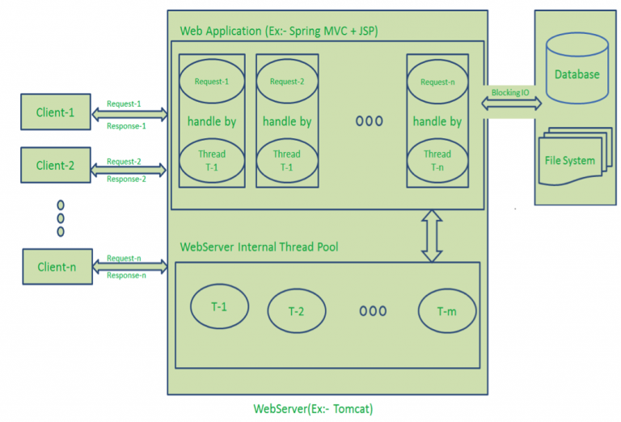
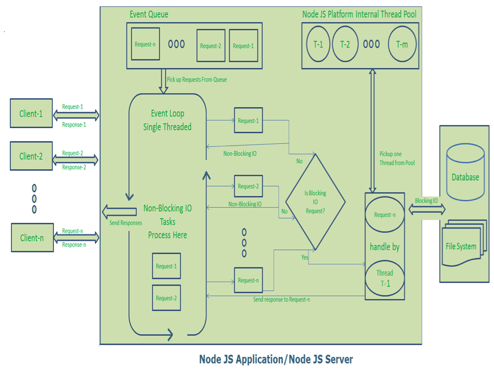

#### 1. 基本概念-单线程模型

引用一句话来解释：“Node JS applications uses “Single Threaded Event Loop Model” architecture to handle multiple concurrent clients.”

这种特性使Node具备很多特性，相比较传统的server framework而言。

#### 2. 传统的web application处理模式

总结起来就是： “Multi-Threaded Request-Response”。当clients向server发送请求后，服务端会基于请求处理，并返回结果。大致可以分为以下几步：

+ Clients Send request to Web Server.
+ Web Server internally maintains a Limited Thread pool to provide services to the Client Requests.
+ Web Server is in infinite Loop and waiting for Client Incoming Requests
+ Web Server receives those requests.
	+ Web Server pickup one Client Request
	+ Pickup one Thread from Thread pool
	+ Assign this Thread to Client Request
	+ This Thread will take care of reading Client request, processing Client request, performing any Blocking IO Operations (if required) and preparing Response
	+ This Thread sends prepared response back to the Web Server
	+ Web Server in-turn sends this response to the respective Client.

尽管这种模式可以处理大量的并发请求，但是缺点也很明显。当并发请求书增加，这种模式将会创建越来越多的threads，进而吃掉大量内存。并且，随着请求队列的增加，客户端请求会进入等待模式，等待线程来处理。并且，线程处理I/O也是需要一定的时间开销。

#### 3. NodeJS模式 - 单线程Event Loop

Node JS并不遵循上面的基于Request/response的多线程无状态模式（Request/Response Multi-Threaded Stateless Model）。Node JS的处理模式是以Javascript的event和callback机制为基础的。核心要点是“Event loop”。请看一下处理流程：

1. Clients Send request to Web Server.
2. Node JS Web Server internally maintains a Limited Thread pool to provide services to the Client Requests.
3. Node JS Web Server receives those requests and places them into a Queue. It is known as “Event Queue”.
4. Node JS Web Server internally has a Component, known as “Event Loop”. Why it got this name is that it uses indefinite loop to receive requests and process them. (See some Java Pseudo code to understand this below).
5. Event Loop uses Single Thread only. It is main heart of Node JS Platform Processing Model.
6. Even Loop checks any Client Request is placed in Event Queue. If no, then wait for incoming requests for indefinitely.
7. If yes, then pick up one Client Request from Event Queue
Starts process that Client Request
	+ If that Client Request Does Not requires any Blocking IO Operations, then process everything, prepare response and send it back to client.
	+ If that Client Request requires some Blocking IO Operations like interacting with Database, File System, External Services then it will follow different approach
		+ Checks Threads availability from Internal Thread Pool
		+ Picks up one Thread and assign this Client Request to that thread.
		+ That Thread is responsible for taking that request, process it, perform Blocking IO operations, prepare response and send it back to the Event Loop
		+ Event Loop in turn, sends that Response to the respective Client.

NodeJS相比较多线程服务模式，**优势**在于：

1. Handling more and more concurrent client’s request is very easy.
2. Even though our Node JS Application receives more and more Concurrent client requests, there is no need of creating more and more threads, because of Event loop.
3. Node JS application uses less Threads so that it can utilize only less resources or memory

