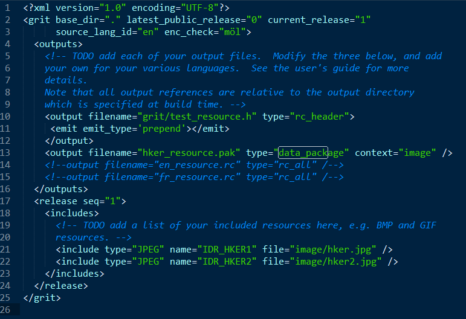

Chromium项目采用Grit工具来打包生成程序需要的资源，比如图片，字符串，html文件等。在Build本地项目的时候，GN工具会调用Grit，并赋予相关参数。
Grit可以接受grd资源描述文件，生成.h，.rc，.pak等生成文件。该工具位于src/tools/grit文件夹下，源码组织方式为python。

#### Chromium调用Grit工具方式

当指定资源文件夹下的BUILD.gn被加载时候，GN会启动grit工具，并指明输入source grd文件，输入文件，以及采用规则grit_rule.gni。图例如下：

grit_rule.gni文件是一个生成命令行脚本，会根据当前执行环境来生成Grit执行的command line。当然具体内容不在这里赘述。它的路径在src/tools/grit/grit_rule.gni。
一些重要的命令行参数：

-i  指定grd源文件

-o  指定资源生成的目录

-D  指定类似于C语言的预处理宏定义,grd描述中有条件控制生成节点的逻辑,这些定义宏可以当命令开关

-f  指定first_ids_file,即前面提到的gritsettings\resource_ids文件

-E  设置grit内部使用的环境变量

#### Grit工具的内部原理

在命令行读入后，Grit启动grit runner模块来读参数，Run函数内部使用grd_reader.py的Parse方法来解析输入的grd文件，然后将该grd文件解析成树状节点结构，方法返回值为grit.node.base.Node。
<pre>
<code>
self.res = grd_reader.Parse(opts.input,
                            debug=opts.extra_verbose,
                            first_ids_file=first_ids_file,
                            predetermined_ids_file=predetermined_ids_file,
                            defines=self.defines,
                            target_platform=target_platform)
</code>
</pre>

不同的树状节点有各自的资源节点类型，这个类型在node/mapping.py里面有详细描述。

左边的key是grd文件中的节点名字，右边是生成的python对象。其中比较关键的节点类：

Node为所有节点的基类, GritNode为树的根节点,程序可以通过此入口遍历其所有的子节点。

OutputNode节点对应grd文件中的output节点,表示要生成的资源文件

FileNode节点对应grd文件中的file节点,通常做为translations子节点,指定某种语言本地化需要的xtb翻译文件

MessageNode节点表示需要打包的文本资源项,同样的资源项还有IncludeNode和StructuresNode节点,用于保存图片等其他资源类型。

在得到Parse函数返回的根节点后，接下来RunGatherers方法会遍历所有子节点，调用节点的RunPostSubstitutionGather（存在的话）。

<pre>
<code>
# Set an output context so that conditionals can use defines during the
# gathering stage; we use a dummy language here since we are not outputting
# a specific language.
self.res.SetOutputLanguage('en')
if rc_header_format:
  self.res.AssignRcHeaderFormat(rc_header_format)
self.res.RunGatherers()
</code>
</pre>

目前已知FileNode会调用此方法，因为用于解析对应的多语言xtb文件。所有节点数据准备好后，就可以生成资源文件了。在Builder的Process方法会遍历outputs节点下面所有的output项，根据type类型指定的资源类型来选择grit.format对应的打包工具。比如：type="data_package"，对应grit.format.data_pack工具。

<pre>
<code>
def Process(self):
# Update filenames with those provided by SCons if we're being invoked
# from SCons.  The list of SCons targets also includes all <structure>
# node outputs, but it starts with our output files, in the order they
# occur in the .grd
...
for output in self.res.GetOutputFiles():
output.output_filename = os.path.abspath(os.path.join(
  self.output_directory, output.GetOutputFilename()))
...
</code>
</pre>
对于其他的类型，可以在build.py的_format_modules找到对应关系。这样grit format下对应的工具会把所有的资源节点拼接为格式化字符串并返回，Process方法会将这个格式化的字符串以编码的形式保存在output指定的文件中。

例如，在生成文件chromium_strings.h中，里面保存了资源的唯一ID值，这些值可以供C++代码调用从而找到资源。文件每一项的格式为：#define  name  节点值   编号值

最后，在data_pack.py中，将遍历的资源节点按类型打包成pak文件，到指定的输出路径供程序调用。
<pre>
<code>
def main():
  if len(sys.argv) > 1:
    # When an argument is given, read and explode the file to text
    # format, for easier diffing.
    data = ReadDataPack(sys.argv[1])
    print data.encoding
    for (resource_id, text) in data.resources.iteritems():
      print '%s: %s' % (resource_id, text)
  else:
    # Just write a simple file.
    data = {1: '', 4: 'this is id 4', 6: 'this is id 6', 10: ''}
    WriteDataPack(data, 'datapack1.pak', UTF8)
    data2 = {1000: 'test', 5: 'five'}
    WriteDataPack(data2, 'datapack2.pak', UTF8)
    print 'wrote datapack1 and datapack2 to current directory.'
...
</code>
</pre>

#### Chromium浏览器程序调用资源

目前已知的情况，chromium内部主要会通过如下方式调用资源，后续有待补充：

| 类型        | 处理类           | 说明链接 |
| :------------- |:-------------:| :-----|
| 字符串      | l10n_util | https://github.com/adobe/chromium/blob/master/ui/base/l10n/l10n_util.cc |
| 图片资源      | resource_bundle      |   https://github.com/adobe/chromium/blob/master/ui/base/resource/resource_bundle.h |

#### Coding Sample：自定义图片资源pak包

1.在/src/content/app下建立自己的image_res文件夹，里面包含图片文件和自定义的grd文件。grd文件格式如下:

2.启动Grit，用如下命令

<pre>
<code>
python ./grit.py -x -i ../../content/app/image_res/test_grid.grd build -o ../../content/app/resources/
</code>
</pre>

3.在./content/app/resources下就可看到生成的pak资源文件和.h文件了。该.h文件定义了图片的ID供调用

<pre>
<code>
// This file is automatically generated by GRIT. Do not edit.
#pragma once

#define IDR_HKER1 2093
#define IDR_HKER2 2094
</code>
</pre>