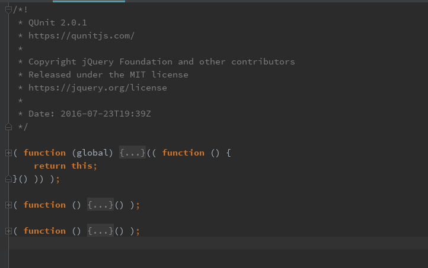

用qunit.js也有一段时间了。虽然这是一个比较老的框架，而且最近一些年也没有在积极地维护。
但是作为一个单元测试框架而言，本身设计和代码质量上有很多可以借鉴的地方。在项目里，我采用qunit-2.0.1版本，而且对原框架进行了深度定制。
下面就展开分析一下.

利用IDE里面的代码块折叠功能，可以将代码折叠为3个主要的代码块，这些code block都采用了 [IIFE](https://stackoverflow.com/questions/8228281/what-is-the-function-construct-in-javascript) 的方式。
