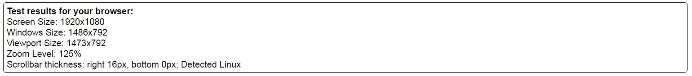

原文链接： [Exporting the TOR Browser](http://www.hackerfactor.com/blog/index.php?/archives/761-Exploiting-the-TOR-Browser.html)

文章核心意义在于阐释：

1. TOR并没有issue reporting

   文章里面给出了观点，指出TOR project官方并没有维护email list。也没有一个透明的issue接收通道。

   

   >I recently wrote to the tor-security email address. I received no reply -- not even an acknowledgment of receipt.

2. 这也是文章核心思想：其实TOR并不是匿名的。它无时无刻不在泄露你的用户（OS）信息

   其实用JS可以测试出用户是否为TOR-BROWSER使用者。这是因为TOR使用了一些default设置，当我用TOR的时候我也遇到过类似的问题：比如当打开TOR窗口浏览网页时候提示不要设置full size浏览器window以防泄露PC隐私。TOR会为你预设一个window size。那么问题就来了，TOR给的预设值是统一的，那么就可以通过这个判断你是否在用。
   文章运行一段脚本可以检测出TOR浏览器的这些default settings：

   <pre>
    <code>
    var sw, sh, ww, wh, vw, vh, v;
    sw = screen.width;
    sh = screen.height;
    document.write("Screen Size: " + sw + "x" + sh + " \n");
    ww = window.innerWidth || document.documentElement.clientWidth || document.body.clientWidth || 0;
    wh = window.innerHeight || document.documentElement.clientHeight || document.body.clientHeight || 0;
    if ((sw == ww) && (sh == wh)) {
        v = '; TOR detected';
        if (!(ww % 200) && (wh % 100)) {
            v += "; TOR on MacOS X";
        }
    } else {
        v = '';
    }
    document.write("Windows Size: " + ww + "x" + wh + v + " \n");
    var e = document.createElement("div");
    e.style.cssText = "position:fixed;top:0;left:0;bottom:0;right:0;";
    document.documentElement.insertBefore(e, document.documentElement.firstChild);
    vw = e.offsetWidth;
    vh = e.offsetHeight;
    document.documentElement.removeChild(e);
    document.write("Viewport Size: " + vw + "x" + vh + " ");
    var Zoom = window.devicePixelRatio;
    document.write("Zoom Level: " + Math.round(Zoom * 100) + "% ");
    sw = Math.round((ww - vw) * Zoom);
    sh = Math.round((wh - vh) * Zoom);
    document.write("Scrollbar thickness: right " + sw + "px, bottom " + sh + "px");
    if (!sw && !sh) {
        document.write("; Detected MacOS X or mobile device");
    } else if ((sw >= 21) || (sh >= 21)) {
        document.write("; Detected Windows 10");
    } else if ((sw >= 17) || (sh >= 17)) {
        document.write("; Detected Windows");
    } else if ((sw == 12) || (sh == 12)) {
        document.write("; Detected Linux, or Edge on Windows 10");
    } else if ((sw == 15) || (sh == 15)) {
        document.write("; Detected Linux, Mac OS X, or Edge on Windows 10");
    } else {
        document.write("; Detected Linux");
    }
    if (sw && sh && (Zoom != 1)) {
        document.write(" (uncertainty due to zoom)");
    }
    document.write(" \n");</code></pre>

   运行结果：

   

   从脚本看出，如果是TOR BROWSER用户，那么这些default settings会让你的个人PC信息暴露无遗。用这样的脚本其实可以很方便的识别出一些TOR使用者。但这也不是绝对的。因为这些缺省值也是可以改变的。只有懒人才会被认出来。

   引用原文的一段话来总结吧：
   > ### **The profiling test demonstrates the following issues:**
   > Window and Screen Size: On a normal desktop browser, the Window Size is smaller than the Screen Size. (Mobile devices may show a Windows Size that is larger than the Screen Size.) To prevent screen profiling, the TOR-Browser sets them to be the same size.

   > **For profiling:** If the Window Size and Screen Size are the same size, then JavaScript can immediately detect the TOR-Browser.

   > **To fix:** The fake Screen Size set by the TOR-Browser should be set to a value larger than the Window Size. All platforms should report the same larger Screen Size.

   > MacOS Window Size: The TOR-Browser sets a consistent Window Size. This prevents profiling the browser based on the browser dimensions. The browser tries for 1000x1000. However, if the screen is smaller than that, then it will choose a width that is a multiple of 200 pixels, and a height that is a multiple of 100 pixels.

   > On MacOS, the TOR-Browser sometimes miscalculates the initial Window Size. This problem is inconsistent and appears to be related to the height of the dock (application menu at the bottom of the Mac desktop). Hiding the dock resolves the problem.

   > **For profiling:** If the TOR-Browser Window Size is a multiple of 200 across but not a multiple of 100 tall, then it is the TOR-Browser on MacOS X. (Or the user manually resized the window -- something that the TOR-Browser warns against. And it is unlikely that the resized window would be a multiple of 200 pixels across.)

   > **To fix:** The TOR-Browser should correctly calculate the initial Window Size in order to be consistent with the TOR-Browser on other platforms.

   > Scrollbar Size: The TOR-Browser takes steps to normalize the Screen and Window Sizes in order to prevent profiling. However, it does not normalize the Viewport Size. If scrollbars are displayed, then the Viewport Size can be subtracted from the Window Size in order to find the thickness of the scrollbars.

   > **For profiling:** The scrollbar thickness is inherited from the operating system. Different operating systems and desktops use different default thicknesses. For example:

   > The TOR-Browser on MacOS 10.11 uses a default thickness of 15 pixels.

   > The TOR-Browser on Windows 7/8/10 uses scrollbars that are 17 pixels thick.

   > The TOR-Browser on Linux uses scrollbars that are 10-16 pixels thick. The thickness depends on the Linux variant and desktop platform, like Gnome or KDE. The variability on Linux makes each platform distinct. Linux Mint with Gtk-3.0 defaults to 10 pixels thick, Ubuntu 16.04 with Gnome uses 13 pixels thick, etc.

   > Although there is no official TOR-Browser for mobile devices, most mobile devices hide scrollbars. The measured scrollbar thickness should be zero. (This is the same on some older MacOS X systems, like 10.5. But the TOR-Browser also doesn't run on 10.5, so this is a non-issue.)

   > Non-TOR browsers, like Edge on Windows 10, also uses variable sizes. I have seen both 12 and 15 pixels for Edge. However, that's not the TOR-Browser.

   > Basically, if you can detect the TOR-Browser (easy! see issue #1) and the scrollbars are 17 pixels thick, then it's the TOR-Browser on Windows. If the scrollbars are 15 pixels thick, then it's either Linux or Mac OS X (check the window height to distinguish Mac from Linux; see issue #2). And any other thickness denotes Linux.

   > **To fix:** The TOR-Browser should define (not inherit) the scrollbar width. A value of 17 would make all browsers indistinguishable and implies Windows (the majority platform) even if they are not on Windows.

   记住，TOR-Browser不能保证在所有平台的一致性。每个平台都有独有的属性，运行在上面难免会有痕迹。所以不能指望TOR来匿名（anonymize）一切，作为一个理性用户首先要质疑其安全性，保持清醒的合理使用这个工具。