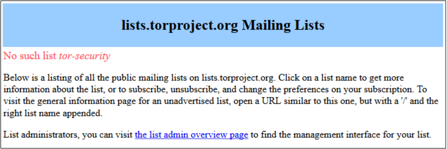

原文链接： [Exporting the TOR Browser](http://www.hackerfactor.com/blog/index.php?/archives/761-Exploiting-the-TOR-Browser.html)

文章核心意义在于阐释：

1. TOR并没有issue reporting

   文章里面给出了观点，指出TOR project官方并没有维护email list。也没有一个透明的接收通道。

   

   >I recently wrote to the tor-security email address. I received no reply -- not even an acknowledgment of receipt.

2. 这也是文章核心思想：其实TOR并不是匿名的。它无时无刻不在出卖用户隐私

