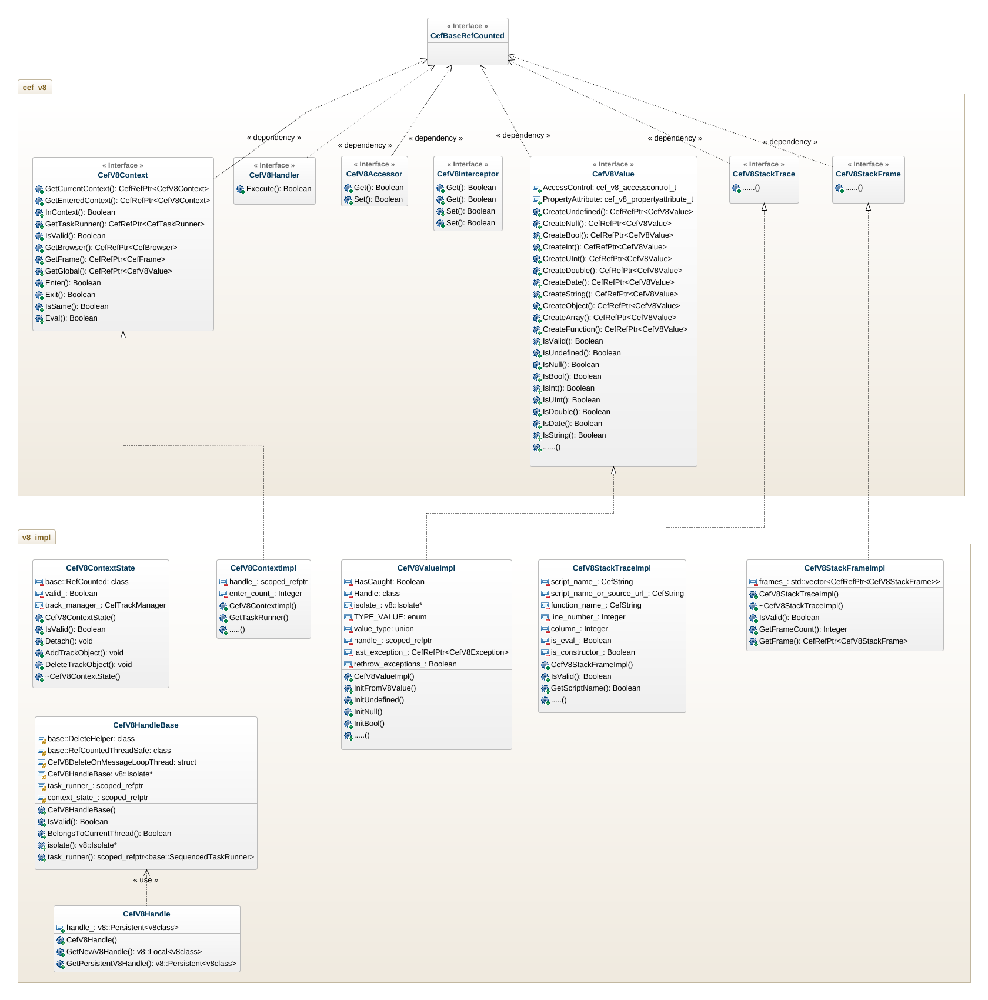
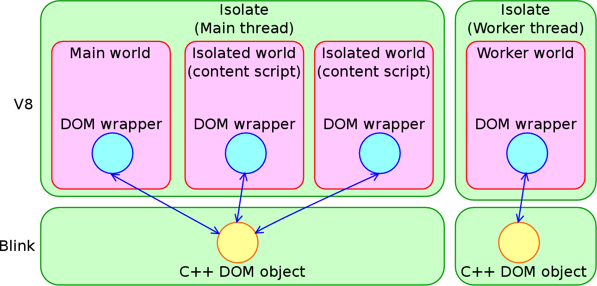
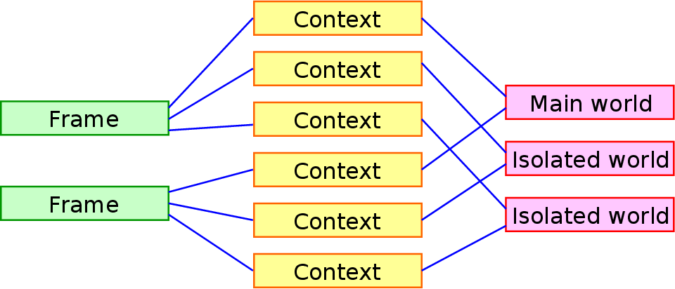

#### 前言

由于要实现我司原有的JS扩展层（ModelJS）来支撑UI上的大量接口，而这些接口又没有定义，直接在浏览器里面声明全部报错，需要Native code来进行支持。所以，参照原来Opera给出的方案，组里开始寻找替代品，最终找到了CEF来进行支持。

#### 总体结构

CEF类似于chromium content shell，但是它又大量封装了自己的实现部分，所以不是完全相同的。个人粗略认为content shell是比CEF更加纯净的一个view shell。由于近来研究需要，对CEF的V8实现部分进行了较深入的研究。直接先上图：



首先说明一点，这个类图的**v8_impl部分没有把所有的类都包含进来**，只是显示了一部分关联上层的类。具体的部分还是要看源码。给出这张图目的只是展示大体结构。
其实这一块CEF做的东西并不是特别复杂，cef_v8定义了各个接口类，然后在v8_impl部分进行了实现，且定义好自己的数据结构，context，isolate等等。
总的来说，CEF V8实现部分是对原有V8的东西进行了扩展。接下来，要对一些用到的基本概念进行总结。

-----------------------------------------------------------------------------------------------------------------------------
#### 基本概念

##### Isolate

一个Isolate可以理解为是一个V8 instance。在blink中，isolate和thread是1：1的关系。一个isolate有一个main thread和一个worker thread。有一张图例可以展示isolate的大致概念：



##### Context

在V8中，Context是一个全局变量作用域(global variable scope)的概念。简要的说，一个window object对应一个context。比如在浏览器中，<iframe>标签可以代表着一个window object，而该window object的作用域与父frame并不一致。
这是因为他们具有不同的contexts，各个contexts又具有不同的global variable scope和prototype chain。从而parent frame和current frame相互隔离。举官网的例子说明：

```
// main.html
<html><body>
<iframe src="iframe.html"></iframe>
<script>
var foo = 1234;
String.prototype.substr =
    function (position, length) { // Hijacks String.prototype.substr
        console.log(length);
        return "hijacked";
    };
</script>
</body></html>

// iframe.html
<script>
console.log(foo);  // undefined
var bar = "aaaa".substr(0, 2);  // Nothing is logged.
console.log(bar);  // "aa"
</script>
```
这段例子清晰展示了不同context之间的隔离关系。

##### Entered context and current context

由于在一个isolate中，可能会具有多个frames，而每个frame具有自己的context，简要的说，isolate和context的关系是一对多。所以不同的context就会有相互进入(Enter)的情况。
要理解entered context和current context的区别，就要了解两个runtime stacks。
第一个stack是JS functions stack。这个栈是由V8来统一管理，当一个function调用另一个function时候，被调用（callee）的function会被压入栈中。当callee函数返回时候，函数从栈中弹出，并返回调用函数，而此时的调用函数是在栈顶。
这里function都有各自的context，我们称当前运行的函数的context为current context。例如官网给出的例子：
```
// main.html
<html><body>
<iframe src="iframe.html"></iframe>
<script>
var iframe = document.querySelector("iframe");
iframe.onload = function () {
    iframe.contentWindow.func();
}
</script>
</body></html>

// iframe.html
<script>
function func() {
  ...;
}
</script>
```
上述例子中，func()在运行时候，current context就是<iframe> context。

第二个stack由V8 binding来管理。我们可以称为context stack。当V8 binding调用JS时候，V8 binding进入一个context并将当前context压入栈顶，然后JS在当前context下运行了。如果当前JS执行完后，控制权交还给V8 binding，并将栈顶context弹出。
栈的push和pop操作是由以context为传入参数的V8 API完成，也可显式调用8::Context::Enter()和v8::Context::Exit()。我们将之前进入的context为entered context。以上述程序为例，当func()运行时候，entered context是main frame的context（而不是<iframe>）。
这就好比一个链表，entered context是指向当前current context的前一个链表节点。

还有个特殊的context叫debugger context，在这里就不多介绍了。

##### World

对于world，个人认为相当于一个容器，好像tomcat那种概念。在上面的图例中可以看到world的位置。对于world一共有三种形式：main world, isolated world, worker world。
Main world是从web获取的JS的执行容器，isolated world是chrome扩展部分的content script的执行容器。main world和isolated world是一对多的关系。而worker world是在worker thread中的。
所有的worlds可以共享C++ DOM objects，但是每个world需要有自己的DOM wrappers。需要注意的是，每个world也具有自己的context。这意味着world也有自己的global variable scope和prototype chain。
在这种架构下，world内的JS变量是不可以相互共享的。这是出于安全考虑。最简单的一个例子，比如chrome extension可以在共享的标准DOM结构下在沙箱里运行自己的untrusted JS code，就是基于这种设计。

##### isolate, context, world, frame之间的关系

1. 从DOM角度来讲，一个HTML网页有N个frames，每个frame具有自己的context。
2. 从JS的角度讲，一个isolate有M个worlds，每个world有自己的context。

那么总结下，当main thread执行时候，就有N个frames和M个worlds参与进来，总共有N*M个contexts。见下图



也就是说main thread只允许一次存在一个current context，在其生命周期中有N*M个contexts被创建。

##### DOM wrapper和context联系

当一个DOM wrapper被创建，就需要为其指定一个适合的context。如果DOM wrapper在一个错误的context中创建，那么会导致JS object leaking，从而产生异常。

---

#### CEF render创建JS extension的时序


在源码中，首先在CEF client app render中声明了handler，接着注册一个扩展（extension）。在CefRegisterExtension()方法中，根据时序图可以看到具体做了哪些。
这里要说明下，这里的Isolate在源码中并没有给出具体是哪个，代码注释部分只是提到了*Chromium uses the dafault Isolate for the main render process thread and a new Isolate for each WebWorker thread.*
在个地方我理解是用的default main thread下的isolated world，在这个world里面执行content script。然后看时序图，注册了自己的object，用global_manager来在current context添加object。接着在这个context下声明一个DOM wrapper，以访问blink的C++ DOM object。
最有由content::RenderThread来完成该extension的注册。这样，在JS里面声明modeljs就可以从current context拿到这个object了。

那么，到现在为止只是生成了一个object（modeljs），我们还要对这个modeljs做扩展，给它加方法和属性。对于给modeljs加方法，要用到时序图里注册好的CefV8Handler的Execute()。而对于给modeljs加属性，则要用到CefV8Accessor。
这些东西在modeljs的JS扩展部分都有实现的代码。之后会另起一篇文章具体介绍。

注意到时序里面声明了一个isolate manager，在这里说明下这个manager，我定位到这段code：

```
  CefV8IsolateManager()
      : isolate_(v8::Isolate::GetCurrent()),
        task_runner_(CefContentRendererClient::Get()->GetCurrentTaskRunner()),
        message_listener_registered_(false),
        worker_id_(0) {
    DCHECK(isolate_);
    DCHECK(task_runner_.get());
  }
```
很明显，这段用到了V8::Isolate::GetCurrent方法。进一步查找官网，有这样的说明：
*Isolate represents an isolated instance of the V8 engine. V8 isolates have completely separate states. Objects from one isolate must not be used in other isolates. When V8 is initialized a default isolate is implicitly created and entered. The embedder can create additional isolates and use them in parallel in multiple threads. An isolate can be entered by at most one thread at any given time. The Locker/Unlocker API must be used to synchronize.*
也就是说，GetCurrent拿到的是当前thread进入的isolate的，而只在CEF源码中并没有找到Isolate::New声明部分。那么结合上面描述，每次V8初始化的时候都会隐式创建一个default isolate。我们可以由此推断，当前GetCurrent返回的isolate很可能是这个default isolate或者是当前render process的一个isolate。
CEF代码本身没有创建Isolate。这样做的初衷我想是由于isolate创建本身就有很多overhead，没必要这样去做。

结合上面的图例，拿到了current isolate，之前的JS原生代码（不需要native扩展的）就可以main world里面执行，直接通过wrapper调用blink的DOM element，而扩展代码在注册过的isolate world里面会进行解析执行。由ExtensionWrapper声明V8::Extension：

```
// V8 extension registration.

class ExtensionWrapper : public v8::Extension {
 public:
  ExtensionWrapper(const char* extension_name,
                   const char* javascript_code,
                   CefV8Handler* handler)
      : v8::Extension(extension_name, javascript_code), handler_(handler) {}
```
从而，CEF使原JS engine有了识别JS扩展的能力。

---

#### 总结

总的来说，搞清楚了CEF V8一些框架性的结构，包含一些基本概念和启动流程。接下来的工作重心可能会包含CEF源码移植，裁剪，JS扩展实现对接等等。

#### 引用
1. [V8 blog](https://v8project.blogspot.jp/)
2. [V8::isolate class](http://bespin.cz/~ondras/html/classv8_1_1Isolate.html)
3. [V8 Embedder's Guide](https://github.com/v8/v8/wiki/Embedder%27s-Guide)
4. [Views windowing](http://www.chromium.org/developers/design-documents/views-windowing)