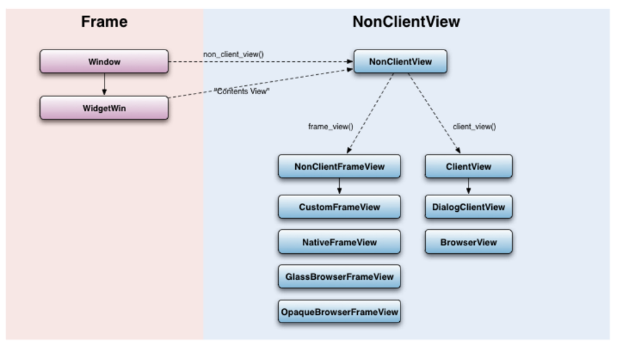

Views是用来展示给用户一些基本的信息。本文围绕着views来梳理下一些基本的概念性的东西，也算是阶段性的总结。

#### views background
views是一个rendering system。但是并不像Webkit那样渲染网页。Views是UI层会构建一个的一个component tree。在UI上面，views负责渲染，构建视图，处理事件等。在component tree中，每个view负责UI的一部分。正如同HTML tree结构那样。

每个view的根层是一个widget，同样也是一个native window。Native window可以从窗口接收消息，并把消息解释成View层可以识别的形式，然后把消息传递给RootView。然后由RootView发送事件给View层。

绘制和构图的原理类似。每个在View tree中的view都有边界（bound），所以绘制的时候，在边界内的部分会被重绘。渲染整个view tree都是在以Widget为单位的单个canvas中完成的。这期间需要调用skia和GDI的部分内容。

#### views Windowing

views可通过Widget object来创建对话框或者其他的windows。开发人员可以实现一个WidgetDelgate来展示窗口，提供必要信息显示，并为窗口事件提供callbacks。这样说是比较笼统的，官网上这部分也没有很具体的信息，参照官网上的一段code实例：
http://www.chromium.org/developers/design-documents/views-windowing

```
//创建一个window
#include "base/basictypes.h"
#include "base/compiler_specific.h"
#include "base/utf_string_conversions.h"
#include "ui/gfx/canvas.h"
#include "ui/views/controls/label.h"
#include "ui/views/view.h"
#include "ui/views/widget/widget.h"
#include "ui/views/widget/widget_delegate.h"

class WindowView : public views::WidgetDelegateView {       //一个window view
 public:
  WindowView() : label_(NULL) {
    Init();
  }

  virtual ~WindowView() {}

 private:
  // Overridden from views::View:
  virtual void OnPaint(gfx::Canvas* canvas) OVERRIDE {      //绘制
    canvas->FillRect(GetLocalBounds(), SK_ColorWHITE);
  }
  virtual void Layout() OVERRIDE {      //结构
    gfx::Size ps = label_->GetPreferredSize();
    label_->SetBounds((width() - ps.width()) / 2, (height() - ps.height()) / 2, ps.width(), ps.height());
  }
  virtual gfx::Size GetPreferredSize() OVERRIDE {       //大小
    gfx::Size ps = label_->GetPreferredSize();
    ps.set_width(ps.width() + 200);
    ps.set_height(ps.height() + 200);
    return ps;
  }

  // Overridden from views::WidgetDelegate:
  virtual string16 GetWindowTitle() const OVERRIDE{     //标题
    return ASCIIToUTF16("Hello World Window");
  }
  virtual bool CanResize() const OVERRIDE {
    return true;
  }
  virtual bool CanMaximize() const OVERRIDE {
    return true;
  }
  virtual views::View* GetContentsView() OVERRIDE {
    return this;
  }

  void Init() {
    label_ = new views::Label(ASCIIToUT1F16("Hello, World!"));
    AddChildView(label_);
  }

  views::Label* label_;

  DISALLOW_COPY_AND_ASSIGN(WindowView);
};

...

views::Widget::CreateWindow(new WindowView)->Show();

```

其中，WidgetDelegate是Widget类的代理类，这个代理用于显示窗口，比如title，icon显示，或者是窗口大小的调整。它同事也需要提供callbacks来响应事件，比如窗口关闭事件处理。每个WidgetDelegate有个访问器window()，可以获取当前的window object。根据官网的描述，一个widget有一个ContentsView，这个是由WidgetDelegate提供的。

#### Client and Non client views

对于这两者的区别，官网上有一个清晰的图例：



